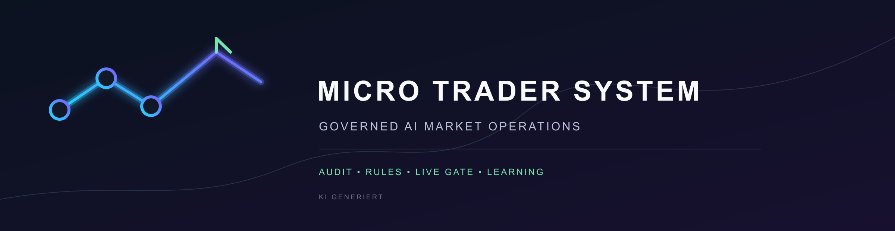

# Micro-Trader — Projekt-Dokumentation (zentral)



> **Micro Trader System** — Governed AI Market Operations
> AUDIT · RULES · LIVE GATE · LEARNING

> ## 🚨 REGEL #1 (unverhandelbar): BACKUP VOR JEDER ÄNDERUNG
> **Kein File wird editiert, ohne ZUVOR ein Backup zu machen.**
> ```bash
> cd /c/Users/goldi/projects/micro-trader
> env -u PYTHONPATH "/c/Program Files/Python312/python.exe" backup.py before "<beschreibung>"
> # ... Änderung durchführen ...
> env -u PYTHONPATH "/c/Program Files/Python312/python.exe" backup.py after "<beschreibung>"
> ```
> **Rollback bei Problemen:**
> ```bash
> env -u PYTHONPATH "/c/Program Files/Python312/python.exe" backup.py list
> env -u PYTHONPATH "/c/Program Files/Python312/python.exe" backup.py restore <id|idx>
> ```
> Siehe `backup.py` (Helfer) + Abschnitt 10 (Backup-Strategie).

**Stand:** 2026-08-02 · **Pfad:** `C:\Users\goldi\projects\micro-trader`
**Runtime:** Python 3.12 (`C:\Program Files\Python312\python.exe` — **nicht** der Hermes-venv)
**Dashboard:** Flask, Port **5300** (Auto-Refresh 30s)
**Cron:** Hermes Job `c0e89575d724` (alle 15 min, `--mode ki`)

> **Für zukünftige KI-Modelle:** Dieses Dokument ist der authoritative Einstiegspunkt.
> Es beschreibt Architektur, Module, Datenfluss, Settings, bekannte Fallen und den
> aktuellen Implementierungsstand. Alle Angaben sind aus dem **live laufenden Code**
> extrahiert (nicht hypothetisch). Neuere Spezifikationen überschreiben ältere.

---

## 0. TL;DR für schnelles Einarbeiten

1. **Was ist das?** Ein autonomes Paper-Trading-System (Aktien/ETF/Spekulation) mit
   KI-gestützten Entscheidungen und einem **selbstlernenden Regelsystem**.
2. **Wie läuft es?** Cron (15min) → Pipeline (News→KI-Entscheidungen→Lernen→Skill-Sync).
   Separater Engine-Cron (5min) führt Trades aus (ohne LLM).
3. **Was lernt die KI?** 7 Mechanismen: Anti-Regeln, Swap-Regeln, Konfidenz-Cap,
   Exit-Score, News-Swap, Multi-Timeframe, Konzentrations-Lernen.
4. **Wie konfiguriere ich?** Tab **⚙️ Einstellungen** im Dashboard (KI + Lernen + Bremsen + News).
   Backend: `settings.json` + `settings_loader.py`.
5. **Wichtigste Fallen:** Venv-Kontamination im Cron (PYTHONPATH entfernen!),
   Zombie-Dashboard-Prozesse auf 5300 (via PowerShell PID killen), JSON-Decode in `ki_log`.

---

## 1. System-Architektur

```
┌──────────────────────────────────────────────────────────────────────┐
│  CRON (Hermes, 15min) → micro-trader-cron.py --mode ki               │
│       │ (PYTHONPATH/PYTHONHOME KOMPLETT entfernt vor Subprozess!)     │
│       ▼                                                              │
│  micro-trader-pipeline.py --mode ki                                 │
│       ├─ news_monitor.py     → RSS sammeln (5 Feeds)                │
│       ├─ ki_news.py          → KI-News-Bewertung + VORFILTER         │
│       ├─ spec_trader.py      → Spekulations-Entscheidungen (48 Tick) │
│       ├─ ki_decisions.py     → KI-Entscheidungen + Caps/Swaps/R3     │
│       ├─ ki_learning.py      → Lernmodul (Regeln, Scores, Kalibrier) │
│       └─ skill_sync.py       → Regeln → Hermes-Skill (ki-trading…)   │
│                                                                      │
│  Engine-Cron (5min, KEIN LLM): boersen.py, engine.py, trader.py     │
│       → Ausführung, Bremsen, Stop-Loss/Take-Profit                  │
└──────────────────────────────────────────────────────────────────────┘
                              │
                              ▼
                   dashboard.py (Port 5300, Flask)
                   liest JSON-State + ki_log.json
                   rendert 8 Tabs (Übersicht/Aktien/ETF/Spek/Analyse/News/KI/Log/Settings)
```

### 1.1 Datenfluss (Lernen)
```
Trading-Entscheidung (ki_decisions)
   → ki_log.json (typ=decision)
   → Engine misst Kurs nach 4h/1d/1w (ki_learning.hole_kurs_entwicklung)
   → Lerneffekt −5…+5 (ki_learning.lerneffekt)
   → ki_learning.analysiere_entscheidungen
       → Regeln (anti_muster_regeln, swap_score, multi_timeframe_regel_lernen)
   → learned_rules.json (Source of Truth)
   → nächste KI-Prompts (ki_decisions lädt via lade_regeln) + Hermes-Skill (skill_sync)
```

---

## 2. Module-Referenz (Funktionen)

### 2.1 `ki_decisions.py` — KI-Entscheidungslogik
| Funktion | Signatur | Zweck |
|----------|----------|-------|
| `entscheide_ticker` | `(ticker, name, kurs, sma20, sma50, rsi, shares, avg_price, bargeld, depot_start, news_liste, markt_status, sektor, atr_pct, vol_ratio)` | **Kern**: LLM-Call → kaufen/halten/verkaufen. Wendet Cap (R1/R3), Exit-Score (R3), News-Swap (R3), lädt **gelernte Regeln in Prompt** (R1), schreibt `angewandte_regeln` ins ki_log. |
| `entscheide_spec_batch` | `(ticker_data_list, max_workers=5)` | Parallel (8 Worker) für 48 Spec-Ticker. |
| `entscheide_aktien_depot` | `(depot, kandidaten, markt_status)` | Aktien-Risikostufen (20 Depots). |
| `news_fuer_ticker` | `(ticker, ki_log, max_std=24)` | Holt News-Score für Ticker. |
| `hole_vix` | `()` | Aktueller VIX. |
| `lade_ki_log` / `schreibe_ki_log` | `(eintrag)` | Thread-safe ki_log.json Zugriff. |

**Settings-Bindung:** `_ki_set("konfidenz_cap")`, `_ki_set("ki_temperatur")`, `_ki_set("news_swap_min_score")`.

### 2.2 `ki_learning.py` — Lern-Engine (80 KB, 1900+ Zeilen)
| Funktion | Zweck |
|----------|-------|
| `lerneffekt(aktion, change)` | Differenzierter Lerneffekt −5…+5. |
| `lerneffekt_multiskalen(ticker, aktion)` | 15min/1d/1w Skalen (R6-Multi-TF). |
| `multi_timeframe_regel_lernen(entscheidungen, min_divergenz=3.0)` | Divergenz-Regeln. |
| `news_swap_score(ticker, pnl, news_score, benchmark_ret)` | Swap-Score für Umschichtung. |
| `news_swap_entscheidung_ueberschreiben(...)` | Überschreibt Entscheidung bei News-Impact. |
| `exit_score_entscheidung_ueberschreiben(...)` | Exit-Score (Trend intakt → halten). |
| `ki_bewerte_lernergebnisse(ergebnisse)` | LLM-Muster-Analyse. |
| `anti_muster_regeln(ergebnisse)` | **R5**: Anti-Regeln ab `anti_min_n` (Settings, Default 5). |
| `analysiere_entscheidungen(...)` | Haupt-Lernloop. |
| `lade_lern_notizen(max_age_stunden)` | Lerneffekt-Notizen fürs Dashboard. |
| `cross_depot_lernen()` | Konzentrations-Lernen. |

**Settings-Bindung:** `_lern_set("anti_min_n")`, `_lern_set("decay_lambda")` (via learned_rules).

### 2.3 `learned_rules.py` — Regelbasis (Source of Truth)
| Funktion | Zweck |
|----------|-------|
| `lade_regeln(include_decay, max_alter_tage, inkl_arktiviert)` | **R2**: Sortiert nach `effektiv_gewicht` (Decay-respektierend). |
| `speichere_regeln(neue_regeln)` | CRUD + Export `ki_regeln.json`. |
| `decay_lambda_global()` | **Settings**: liest `lernen.decay_lambda`. |
| `finde_konflikte(regeln)` | Konflikt-Erkennung (gleiche Aktion + AK, gegensätzlicher Typ). |
| `lebenszyklus_status(regel)` | stabil/wackelig/veraltet. |
| `regeln_mit_status()` | Regeln + Status für Dashboard. |

### 2.4 `engine.py` — Trading-Engine (ohne LLM)
| Funktion | Zweck |
|----------|-------|
| `Depot` (Klasse) | Depot-Logik (Positionen, peak_wert, gesperrt). |
| `scan_markt(tickers, force)` | Markt-Scan. |
| `bewerte(aktien, budget, risk_params)` | Risk-Scoring. |
| `signal_aktion(depot, aktien_bewertet, params)` | Signal-Generierung. |
| `ausführen(depot, aktionen, params)` | **P4**: Konzentrations-Bremse (`max_depot_pro_ticker`), Stop-Loss/TP. |
| `max_depot_pro_ticker()` / `drawdown_sperre_prozent()` | **Settings**: Engine-Bremsen. |

**Drawdown-Sperre (R-Settings):** `aktueller_wert < depot_peak * (1 - drawdown_sperre_prozent()/100)`.

### 2.5 `trader.py` — Basis-Trader
`berechne_indikatoren`, `scan_markt`, `bewerte`, `signal_aktion`, `Depot`-Klasse.
Risk-Parameter: Risk 0–20 (35% pos, −8%/+12%), Risk 50+ (50% pos, −15%/+20%).

### 2.6 `spec_trader.py` / `spec_watch.py` — Spekulation
- `spec_watch.py`: **WATCHLIST** (48 Ticker, 14 Kategorien: crypto, inverse, volatility,
  commodity, lev-bull, lev-bear, meme, ai, ev, biotech, space, index).
- `spec_trader.py`: `SpecDepot`-Klasse, `fetch_analyse()` (6mo Kursdaten), `ausführen()`.

### 2.7 `ki_news.py` — News-Bewertung
- `ist_irrelevant(title)` — **VORFILTER** (Blacklist + Context + Min-Länge, wort-exakt).
- `classify_headline(title)` — 12 Themen.
- `find_tickers(title)` — Ticker-Erkennung.
- `ki_bewerte_news(headlines)` — LLM-Score 0–100.
- `news_analyse(max_headlines, force, min_interval_h)` — Pipeline-Entry.

### 2.8 `settings_loader.py` — Zentrale Settings
- `lade_settings()` — lädt `settings.json` (Fallback: Hardcodierte Defaults).
- `validiere_und_risiko(neue)` — **Risiko**: MIN/MAX + empfohlener Bereich → Warnungen.
- `speichere_settings(neue, bestaetigt)` — speichert nur bei `ok` (Warnung → Bestätigung nötig).
- `ki(name)`, `lernen(name)`, `bremse(name)`, `news_opt(name)` — Modul-Helfer.

### 2.9 `dashboard.py` — Web-UI
- `data()` — JSON-Endpoint (30s Cache), baut alle Tab-Daten.
- `api_settings_get/post()` — Settings-API (GET: Settings+Limits, POST: validiert+speichert).
- Render-Funktionen: `renderOverview`, `renderStocks`, `renderEtf`, `renderSpec`,
  `renderSettings` (⚙️ Tab), `renderKI` (6 Subtabs).

---

## 3. Settings-System (⚙️ Einstellungen)

**Datei:** `settings.json` (zentrale Defaults + Kommentar).
**Loader:** `settings_loader.py` (Validierung + Risikowarnung).

### 3.1 Felder
| Pfad | Default | MIN | MAX | Empfohlen | Risiko-Warnung bei |
|------|---------|-----|-----|-----------|-------------------|
| `ki.konfidenz_cap` | 60 | 0 | 100 | 40–90 | <40: KI ungebremst; >90: lahmgelegt |
| `ki.ki_temperatur` | 0.1 | 0.0 | 0.5 | 0–0.3 | >0.3: instabil |
| `ki.min_konfidenz_kaufen` | 60 | 0 | 100 | 50–80 | <50: Rauschen |
| `ki.exit_score_schwelle` | 70 | 0 | 100 | 50–90 | — |
| `ki.news_swap_min_score` | 75 | 0 | 100 | 50–90 | — |
| `ki.news_swap_aktiv` | true | — | — | — | — |
| `ki.multi_timeframe_lernen` | true | — | — | — | — |
| `lernen.decay_lambda` | 0.01 | 0.0 | 0.05 | 0.005–0.03 | außerhalb: Regeln verfallen zu schnell/langsam |
| `lernen.anti_min_n` | 5 | 1 | 20 | 3–10 | <3: Überreaktion; >10: zu selten |
| `lernen.anti_min_widerlegt_pct` | 60 | 0 | 100 | 40–80 | — |
| `lernen.max_regeln` | 40 | 5 | 200 | 20–60 | >60: Inflation |
| `lernen.lern_modus` | auto | — | — | auto/deterministisch/pausiert | — |
| `kapital.gesamt_budget` | 10000 | 100 | 1000000 | 1000–100000 | zu klein/groß |
| `kapital.aktien_anteil` | 40 | 0 | 100 | 20–60 | zu wenig/viel Exposure |
| `kapital.etf_anteil` | 30 | 0 | 100 | 10–50 | kaum Basis/zu passiv |
| `kapital.spec_anteil` | 30 | 0 | 100 | 5–50 | kaum Chance/zu spekulativ |
| `kapital.max_gesamt_drawdown` | 25 | 5 | 60 | 15–40 | Stopp zu spät/früh |
| `depot_struktur.aktien_stufen` | 20 | 1 | 40 | 5–20 | grob/unübersichtlich |
| `depot_struktur.aktien_schritt` | 5 | 1 | 25 | 5–10 | zu fein/grob |
| `depot_struktur.max_spec_depots` | 48 | 1 | 100 | 10–60 | wenig/viel Klumpenrisiko |
| `depot_struktur.etf_stufen_aktiv` | [6 Stufen] | — | — | — | — |
| `risk_parameter.moderate_position_size` | 0.35 | 0.05 | 0.95 | 0.20–0.50 | zu klein/groß |
| `risk_parameter.moderate_stop_loss` | 0.92 | 0.50 | 0.99 | 0.85–0.95 | Stopp zu eng/weit |
| `risk_parameter.moderate_take_profit` | 1.12 | 1.01 | 3.0 | 1.05–1.30 | TP zu nah/weit |
| `risk_parameter.aggressive_position_size` | 0.50 | 0.05 | 0.95 | 0.30–0.60 | zu klein/groß |
| `risk_parameter.aggressive_stop_loss` | 0.85 | 0.50 | 0.99 | 0.75–0.90 | Stopp zu eng/weit |
| `risk_parameter.aggressive_take_profit` | 1.20 | 1.01 | 3.0 | 1.10–1.40 | TP zu nah/weit |
| `engine_bremsen.max_depot_pro_ticker` | 4 | 1 | 20 | 2–8 | >8: Klumpenrisiko |
| `engine_bremsen.drawdown_sperre_prozent` | 30 | 5 | 60 | 15–40 | <15: zu spät; >40: oft gesperrt |
| `engine_bremsen.wochenende_handel` | false | — | — | — | — |
| `news.news_min_score` | 20 | 0 | 100 | 10–40 | <10: Blindflug |
| `news.news_max_alter_std` | 48 | 1 | 240 | 12–72 | — |

### 3.2 Sicherheitsnetz (doppelt)
1. **Harte Grenzen** (MIN/MAX): Verletzung → POST blockiert (`ok: False`, Fehlermeldung).
2. **Risikowarnung** (empfohlener Bereich): Verletzung → Frontend `confirm()`-Dialog,
   erst bei "OK" wird mit `bestaetigt: true` gespeichert.
3. **Reset Defaults**-Button (eigene Bestätigung).

### 3.3 Modul-Bindung (welche Settings wo greifen)
- `ki_decisions`: `konfidenz_cap` (manuell überschreibt auto-Lernen), `ki_temperatur`, `news_swap_min_score`
- `ki_learning`: `anti_min_n` (Mindest-Sample Anti-Regeln)
- `learned_rules`: `decay_lambda` (via `decay_lambda_global()`)
- `engine`: `max_depot_pro_ticker`, `drawdown_sperre_prozent`
- `dashboard`: `news_min_score` (News-Nachfilter)

---

## 4. Das Lern-System (7 Mechanismen)

| # | Mechanismus | Quelle | Logik | Anwendung |
|---|-------------|--------|-------|-----------|
| 1 | **Anti-Regeln** | `anti_muster_regeln()` | Muster systematisch falsch → Verbot | Prompt-Constraint (NICHT-Regel) |
| 2 | **Swap-Regeln** | `swap_score_berechnen()` | Halte-Position schlechter als Benchmark? | Umschichtungs-Regel (3 Typen) |
| 3 | **Konfidenz-Cap** | `konfidenz_kalibrierung()` | Bin mit hoher Konf. aber 0% Treffer | KI-Konfidenz gedrosselt (60) |
| 4 | **Exit-Score** | `exit_score_berechnen()` | Trend intakt + Verkauf-Wunsch | Verkauf → "halten" (Score ≥70) |
| 5 | **News-Swap** | `news_swap_score()` | News ≥75 + schwach | Halten → "verkaufen" (Score ≥60) |
| 6 | **Multi-Timeframe** | `multi_timeframe_regel_lernen()` | 15min↑/1d↓ Divergenz | Anti/Positiv-Regel |
| 7 | **Konzentrations-Lernen** | `cross_depot_lernen()` | Ticker in ≥4 Depots | Anti-Regel "streuen" |

**Governance-Reihenfolge (R3):** Engine-Bremsen (hart) > Meta-Cap > News-Swap (News≥75) > Exit-Score > KI.
Bei Konflikt (Exit-Score=halten vs News-Swap=verkaufen) **gewinnt News-Swap** (härtere Evidenz),
Konflikt wird in `ki_log` als `regel_konflikt` vermerkt.

---

## 5. Dashboard-Tabs (Optik + Inhalt)

| Tab | Optik | Inhalt |
|-----|-------|--------|
| 📊 **Übersicht** | Hero + Depot-Cards pro Risikostufe | Gesamtwert, Rendite, KI-letzte pro Depot |
| 📈 **Aktien** | Grid (20 Risikostufen) | `renderCard`, Detail mit Chart + News-Impact + KI-Entscheidung |
| 📦 **ETF** | 6 Risikostufen (Geldmarkt→Gehebelt) | Positionen, MaxDD, Fortschrittsbalken |
| 🔥 **Spekulation** | 3 Subtabs: Übersicht/Positionen/Watchlist | 48 Ticker, Kategorie-Filter, Mini-Charts |
| 📊 **Analyse** | CSS-Bars | Top-Ticker + Grund-Statistik (Trefferquote pro Begründung) |
| 📰 **News** | Glass-Cards | KI-bewertet (Score ≥ `news_min_score`), irrelevant rausgefiltert |
| 🤖 **KI-Log** | 6 Subtabs: Auswertung/Entscheidungen/News/Lerneffekte/Regeln/**Was die KI lernt** | Live-Daten aus `ki_log` + `learned_rules` + `lade_lern_notizen` |
| ⚙️ **Einstellungen** | 4 Sektionen (KI/Lernen/Bremsen/News) | Inputs + Risikowarnung + Reset |

**Design:** Helles Glassmorphismus/Apple (Inter-Schrift, radius 12px, Pastell-Akzente).

---

## 6. Bekannte Fallen (für künftige KI-Arbeit)

### 6.1 Venv-Kontamination im Cron
**Symptom:** `ModuleNotFoundError` oder falsche Packages im Cron-Lauf.
**Ursache:** Hermes-venv in `PYTHONPATH`/`PYTHONHOME`.
**Fix:** `micro-trader-cron.py` entfernt beide Variablen vor Subprozess-Start.
**Regel:** Immer `env -u PYTHONPATH -u PYTHONHOME` für manuelle Tests nutzen!

### 6.2 Zombie-Dashboard-Prozesse (Port 5300)
**Symptom:** `curl localhost:5300/data` liefert **alte/veraltete Daten** (kein Code-Effekt sichtbar).
**Ursache:** Mehrfache `dashboard.py 5300`-Starts (aus meinen vielen Neustarts) blockieren den Port;
nur einer bindet, alle anderen crashen — curl trifft den **alten** Prozess.
**Diagnose:**
```powershell
powershell.exe -NoProfile -Command "Get-NetTCPConnection -LocalPort 5300 -State Listen | Select-Object OwningProcess"
powershell.exe -NoProfile -Command "Get-CimInstance Win32_Process -Filter \"Name='python.exe'\" | Where-Object { \$_.CommandLine -like '*dashboard*5300*' } | Select-Object ProcessId"
```
**Fix:** `taskkill /F /PID <pid>` für alle außer dem gewünschten.
**Verifikation:** `curl` liefert `ki_lern_notizen: 291` (nicht 0), `konfidenz_cap: 60`.

### 6.3 JSON-Decode in `ki_log.json`
**Symptom:** `json.JSONDecodeError` beim Laden.
**Ursache:** Concurrent Writes (Engine + KI parallel) ohne Lock.
**Fix:** `ki_decisions.schreibe_ki_log` nutzt `_ki_lock` (threading.Lock). Bei Corruption:
`ki_log.json` manuell bereinigen (letzte valide Zeile behalten).

### 6.4 Decay wird berechnet, aber ignoriert (R2, behoben)
**Alt:** `lade_regeln` sortierte nach `gewicht` statt `effektiv_gewicht`.
**Neu:** Sortierung nach `effektiv_gewicht` (Decay-respektierend).

### 6.5 Regeln lernten, wirkten aber nicht (R1, behoben)
**Alt:** `learned_rules` wurden im `ki_decisions`-Prompt **nicht** eingebunden.
**Neu:** `GELERNTE REGELN`-Block im Prompt + `angewandte_regeln` im `ki_log`.

---

## 7. Aktueller Implementierungsstand

### Abgeschlossen (verifiziert, live)
- [x] **R1:** Gelernte Regeln in KI-Prompt + `angewandte_regeln` im ki_log
- [x] **R2:** Decay-respektierende Sortierung (`effektiv_gewicht`)
- [x] **R3:** Explizite Konflikt-Priorität (Governance + `regel_konflikt`-Log)
- [x] **R4:** Einmal-News-Injektion (Score-Liste, nicht doppelter Fließtext)
- [x] **R5:** Ausreißer-Schutz (Anti-Regeln ab `anti_min_n`=5, ≥60% widerlegt)
- [x] **Settings:** `settings.json` + `settings_loader.py` + API + ⚙️ Tab + Modul-Bindung + Risikowarnung
- [x] **News-Filter:** VORFILTER (irrelevant) + NACHFILTER (Score < `news_min_score`)
- [x] **KI-Lern-Tab:** "Was die KI lernt" (Subtab, Live-Daten)
- [x] **Dashboard:** 8 Tabs, Auto-Refresh 30s, alle Features live

### Bewusst NICHT gemacht (Scope-Eingrenzung durch User)
- Keine Kapital-Allokation (Gesamt-Budget, %-Splits) — nur KI/Lernen/Bremsen/News in Settings
- Keine Watchlist-Erweiterung (48 Ticker fix)
- Keine neuen Lernmodule (nur Bestandshärtung)

---

## 8. Quick-Start für künftige KI-Sessions

```bash
# 1. Environment sauber setzen (WICHTIG: kein Hermes-venv!)
cd /c/Users/goldi/projects/micro-trader
env -u PYTHONPATH -u PYTHONHOME "/c/Program Files/Python312/python.exe" -c "import ki_decisions; print('OK')"

# 2. Dashboard starten (nur ein Prozess!)
# (vorher alte 5300-Prozesse via PowerShell killen, siehe 6.2)
env -u PYTHONPATH "/c/Program Files/Python312/python.exe" dashboard.py 5300

# 3. Cron-Test (simuliert)
env -u PYTHONPATH "/c/Program Files/Python312/python.exe" "C:/Users/goldi/AppData/Local/hermes/scripts/micro-trader-cron.py" --mode ki

# 4. Settings testen
curl -s http://127.0.0.1:5300/api/settings | python -m json.tool
```

### Verifikations-Checkliste (nach Code-Änderungen)
- [ ] `env -u PYTHONPATH` genutzt (kein venv-Leak)
- [ ] Dashboard neu gestartet (alter 5300-Prozess gekillt?)
- [ ] `curl /data` liefert `ki_lern_notizen > 0`, `konfidenz_cap: 60`
- [ ] Cron-Lauf: `tail cron_pipeline.log` → "Pipeline fertig", keine Fehler
- [ ] Bei Settings-Änderung: API POST mit `bestaetigt: true` getestet

---

## 10. Backup-Strategie (REGEL #1)

**Prinzip:** Kein File wird editiert, ohne ZUVOR ein Backup zu machen. Jede Änderung,
die dem System nicht gut tut, muss sofort zurückgespielt werden können.

### 10.1 Helfer: `backup.py`
```bash
# Vor jeder Änderung:
env -u PYTHONPATH "/c/Program Files/Python312/python.exe" backup.py before "R6: news-filter tuning"

# ... Änderung durchführen ...

# Nach erfolgreicher Verifikation:
env -u PYTHONPATH "/c/Program Files/Python312/python.exe" backup.py after "R6: news-filter tuning"

# Bei Problemen – letzte Snapshots anzeigen:
env -u PYTHONPATH "/c/Program Files/Python312/python.exe" backup.py list

# Zurückspielen (idx aus list, oder id-Präfix):
env -u PYTHONPATH "/c/Program Files/Python312/python.exe" backup.py restore 0
```

### 10.2 Was wird gesichert
- **Vollständig:** alle `*.py`, `*.json` (außer riesige Logs >5MB), `*.html`, `*.md`, `*.cfg`
- **Nicht im Backup** (nur live-State, zu groß): `ki_log.json`, `spec_log.json`,
  `system_log.json`, `regel_history.json` → beim Restore bleiben diese erhalten.
- **Speicherort:** `backups/<ZEITSTEMPEL>__<BESCHREIBUNG>/` mit `_META.json`.

### 10.3 Restore-Garantie
- Restore kopiert Dateien 1:1 zurück (shutil.copy2, timestamps erhalten).
- Danach: Modul-Import testen (`python -c "import dashboard, ki_decisions"`).
- Dashboard-Neustart nicht vergessen (alter 5300-Prozess killen, siehe 6.2).

### 10.4 Workflow-Checkliste (pro Änderung)
- [ ] `backup.py before "<desc>"` ausgeführt
- [ ] Änderung durchgeführt
- [ ] Funktionstest (Modul-Import + ggf. Cron/API)
- [ ] Bei Fehler: `backup.py restore <id>` → sofortiger Rollback
- [ ] Bei Erfolg: `backup.py after "<desc>"`

---

## 11. Version-Log (Changelog)

**Quelle:** `version.json` (Single Source of Truth). Anzeige im Dashboard-Header
(`#versionBadge`, via `/api/version`). Bei jeder Änderung: `version.json` aktualisieren!

| Version | Datum | Codename | Änderung |
|---------|-------|----------|----------|
| Version | Datum | Codename | Änderung |
|---------|-------|----------|----------|
| **2.25.1** | 2026-08-08 | Drawdown weg | 🚫 Drawdown-Warnungsbalken entfernt (kein Mehrwert) |
| **2.25.0** | 2026-08-08 | Security-Hardening | 🔐 Login-Rate-Limit (5 Fails → Exp-Backoff 30s+), IP+UA im Audit-Log, Admin-Tabs 🌐 Logins (IP-Analytik/Brute-Force) + 🛡️ Sicherheit (OWASP-Checkliste: Hashing/Headers/Netzwerk/MFA) |
| **2.24.0** | 2026-08-08 | Admin neu | 🔧 Admin-Bereich komplett neu (StufenPilot-Design): Stat-Cards, Warnungen, System-Ereignisse, Datenbestand, Audit-Suche, Trading-Pause |
| **2.23.1** | 2026-08-08 | UI-Politur | 🎨 Landingpage-Hero (2-Spalten + Features), User-Area im Header (Avatar+Dropdown: Konto/Einstellungen/Admin/Logout), Einstellungen listenartig |
| **2.23.0** | 2026-08-08 | Benutzerverwaltung | 👥 8 API-Routen (users/me), Einstellungen-Tabs Mein Konto + Benutzer (Admin), Rollen-Auth, 45 Tests |
| **2.22.3** | 2026-08-08 | Landing-Login | 🏠 Landingpage mit Banner+Logo+Inline-Login (StufenPilot-Muster), route_class-Pattern-Fix (assets/reports) |
| **2.22.2** | 2026-08-08 | Route-Fix | 🔀 / = Landingpage PUBLIC, /dashboard = AUTHENTICATED, CSP-Fonts-Fix |
| **2.22.1** | 2026-08-08 | UTF-8 + Port | 🐛 batch_trader UTF-8-Fix, start.bat Port 5299→5300 |
| **2.22.0** | 2026-08-08 | Server-Sicherheit | 🔒 Phasen 7–9: ROUTE_ACCESS/require_role, Secret-Schutz, 34 Tests |
| **2.21.0** | 2026-08-07 | Spec-Upgrade | 🔥 Spec-Trader 49 Depots, Watchlist, KI-Log-Integration |
| **2.20.0** | 2026-08-07 | 20+20+49 | 📊 Depot-Struktur Aktien/ETF/Spekulation, PDF-Report, Archiv |
| 2.19.x | 2026-08-06 | Stabilität | 🐛 Root-Cause-Fixes, Rendite-Korrekturen, Watchdog |
| 2.18.x | 2026-08-05 | Analyse | 📈 Analyse-Tab, Analyse-DB, News-Swap |
| 2.17.x | 2026-08-04 | Learning | 🧠 KI-Lernmodul Multi-Timeframe, Lerneffekt |
| 2.16.x | 2026-08-03 | Base | 📦 ETF-Rating 5 Stufen, Depot-Rollout, Börsen-Chips |
| **2.7.0** | 2026-08-02 20:45 | Chips & Clarity | 📡 Markt-Chips (nur reale Börsen im Portfolio + Wert-Anteil%) · 💡 Settings mit natürlichen Namen + Layman-Erklärungen + Tab-Einleitungen |

**Version-Bump-Regel:** Bei jeder abgeschlossenen Änderung `version.json` hochzählen
(MAJOR.MINOR.PATCH) + `released_at` + neuen Changelog-Eintrag. Dashboard zeigt
`vX.Y.Z · <Datum> · <Codename>` im Header (Hover = letzte 3 Changes).

---

## 12. Börsen-Meta-Daten (Markt-Chips)

**Quelle:** `boersen.py` (Mapping Ticker→Börse) + `exchanges`-Feld in Depot-JSONs.

Die Markt-Chips im Header zeigen **nur die Börsen, die im Portfolio wirklich vorkommen**
(samt Wert-Anteil %). Umsetzung:

1. `engine.py:74` schreibt beim Scan `data["exchanges"] = {t: boerse_fuer_ticker(t) for t in positions}`
   → jedes Aktien-Depot (`depot_XXX.json`) hat ein `exchanges`-Feld (Ticker→Börse).
2. `boersen.py` liefert das Mapping:
   - `boerse_fuer_ticker(ticker)` → Suffix-basiert (`.DE/.F` → XETRA, sonst US/NYSE/NASDAQ)
   - `BOERSEN` → Label + Zeitzone + Öffnungszeiten pro Börse
   - `ist_offen(boerse)` → geöffnet/geschlossen (Werktag + Handelszeit)
3. `dashboard.py: boersen_chips()` sammelt aus allen Depots (Aktien `exchanges`, ETF, Spec)
   die gehaltenen Börsen + berechnet **Wert-Anteil** (Summe Positionen an Börse / Gesamtwert).
   Crypto-Ticker (BTC/ETH/etc.) → eigener "🪙 Crypto 24/7"-Chip.
4. Frontend rendert Chips (flex-wrap): `🔴 NYSE/NASDAQ 100%` (nur reale Börsen, kein toter Chip).

**Hinweis:** `exchanges` ist leer (`{}`), wenn ein Depot keine Positionen hat — dann
wird der Ticker beim Chip-Bauen live via `boerse_fuer_ticker()` bestimmt.

---

## 13. Settings: Natürliche Namen + Erklärungen

Alle Einstellungsfelder haben in `settings_loader.py` (`LABELS`-Map) einen
**Anzeige-Namen** (statt technischem Pfad) + **Layman-Erklärung** (1–2 Sätze, was es bewirkt).
Das Frontend (`dashboard.html: settingsInput/settingsBool`) rendert:
- Fettgedruckter Name (z.B. "Max. Selbstvertrauen der KI" statt `konfidenz_cap`)
- Graue Erklärung darunter
- Empfohlen-Bereich als "⚖ 40–90%"
- Tab-Einleitung (TAB_INTRO) pro Kategorie

---

## 14. Modul-Größen (Referenz)

| Datei | Zeilen | Rolle |
|-------|-------|------|
| `ki_learning.py` | 1900+ | Lern-Engine (Regeln, Scores, Kalibrierung) |
| `ki_decisions.py` | 550 | KI-Entscheidungen + Caps/Swaps/R1/R3 |
| `learned_rules.py` | 490 | Regelbasis CRUD + Status + Konflikte |
| `engine.py` | 570 | Trading-Engine (Bremsen, Ausführung) |
| `trader.py` | 560 | Basis-Trader (Indikatoren, Depot) |
| `spec_trader.py` | 240 | Spekulations-Logik |
| `spec_watch.py` | 280 | 48-Ticker-Watchlist (14 Kategorien) |
| `ki_news.py` | 390 | News-Bewertung + VORFILTER |
| `settings_loader.py` | 160 | Settings-Validierung + Risiko |
| `dashboard.py` | 820 | Flask + 8 Tabs + Settings-API |
| `dashboard.html` | 1800+ | Vanilla-JS UI (Glassmorphism) |
| `micro-trader-cron.py` | (Hermes scripts) | Cron-Orchestration |

### State-Files (JSON)
- `ki_log.json` (220 KB) — alle Entscheidungen + Lerneffekte + News
- `learned_rules.json` (16 KB) — Regelbasis (Source of Truth)
- `settings.json` (0.7 KB) — zentrale Einstellungen
- `news_cache.json` — bewertete News
- `regel_history.json` (50 KB) — Regel-Änderungshistorie
- `system_log.json` (80 KB) — System-Log
- `depot_XXX.json` — Aktien-Depot-State (20×)
- `spec_log.json` (1.7 MB) — Spec-Trading-Historie

---

*Dokument erstellt: 2026-08-02. Standbild aus live laufendem System.*
*Vorgänger-Docs: `KI-SYSTEM-DOKUMENTATION.md`, `KI-LERNEN-DETAIL.md` (älter, vor R-Phasen/Settings).*
